# ESP-Owlet (ESP-Brookesia) Architecture Document

[中文版本](#中文版本-architecture-document)

## Table of Contents

- [1. Overview](#1-overview)
- [2. High-Level Architecture](#2-high-level-architecture)
- [3. Layer Diagram](#3-layer-diagram)
- [4. Component Dependency Graph](#4-component-dependency-graph)
- [5. Core Component Internal Structure](#5-core-component-internal-structure)
- [6. Service Layer Architecture](#6-service-layer-architecture)
- [7. Agent Layer Architecture](#7-agent-layer-architecture)
- [8. Product Composition](#8-product-composition)
- [9. Build System & Configuration Flow](#9-build-system--configuration-flow)
- [10. Data Flow](#10-data-flow)

---

## 1. Overview

ESP-Owlet (based on ESP-Brookesia) is a monorepo framework for building AIoT products on Espressif chips (ESP32-P4, ESP32-S3, etc.). It provides a modular, plugin-based architecture with:

- **GUI Framework** built on LVGL 9.2
- **AI Framework** with multi-provider LLM agent support (OpenAI, Coze, Xiaozhi)
- **Service Layer** with RPC, event pub/sub, and plugin lifecycle management
- **System Shells** for Phone and Speaker form factors
- **Application Plugin System** for modular UI apps

---

## 2. High-Level Architecture

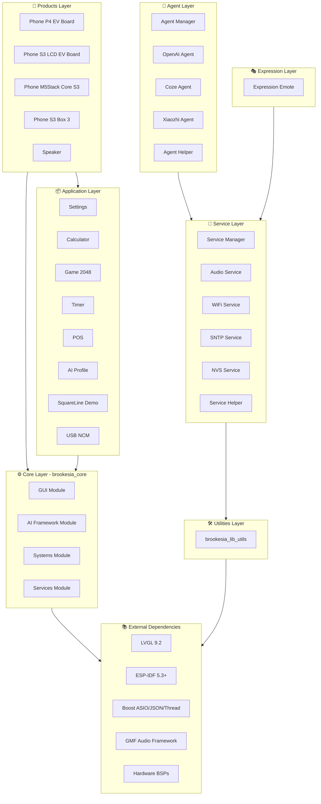

---

## 3. Layer Diagram

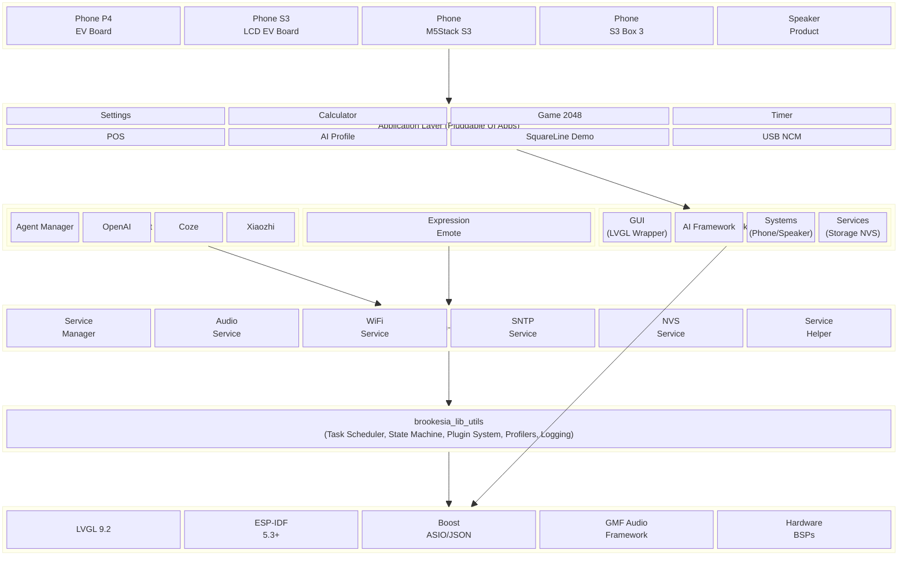

---

## 4. Component Dependency Graph

### 4.1 Service Layer Dependencies

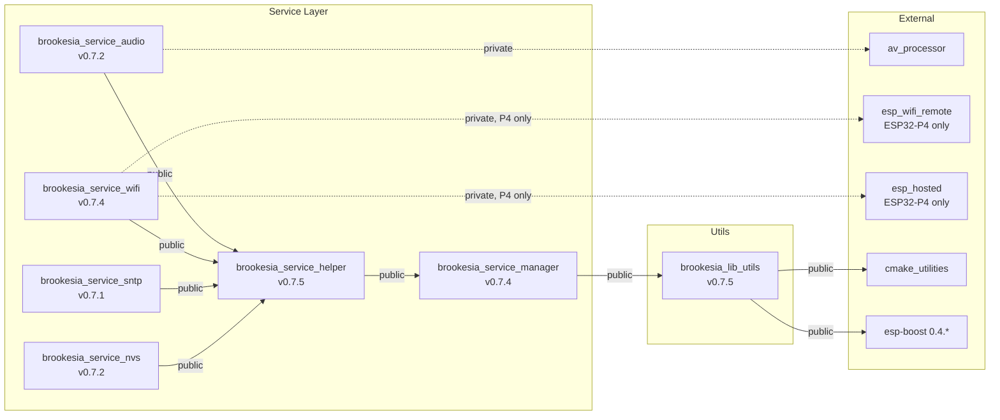

### 4.2 Agent Layer Dependencies

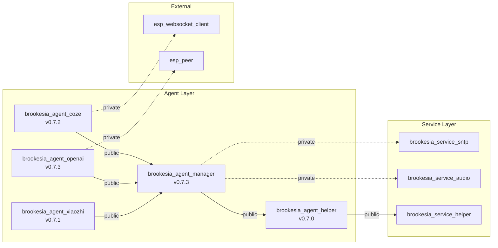

### 4.3 Full Dependency Graph

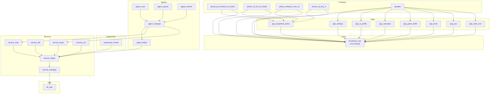

---

## 5. Core Component Internal Structure

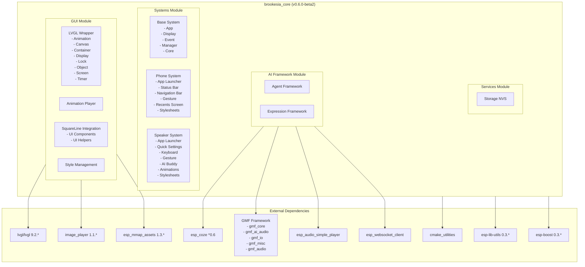

### Kconfig-Controlled Conditional Compilation

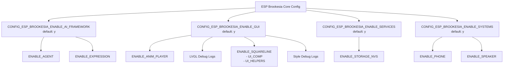

---

## 6. Service Layer Architecture

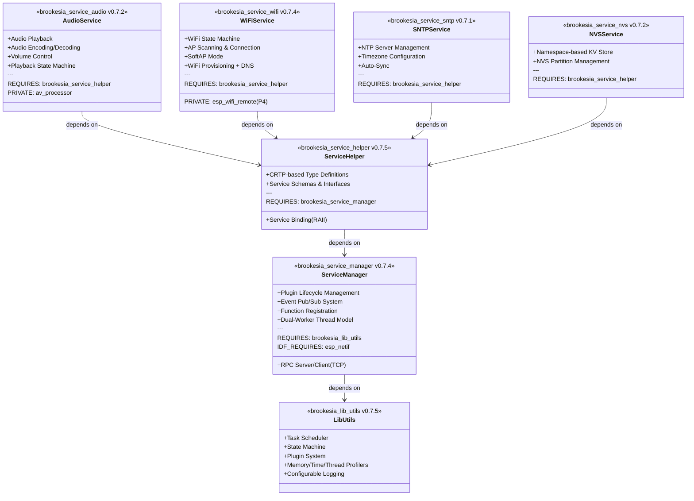

---

## 7. Agent Layer Architecture

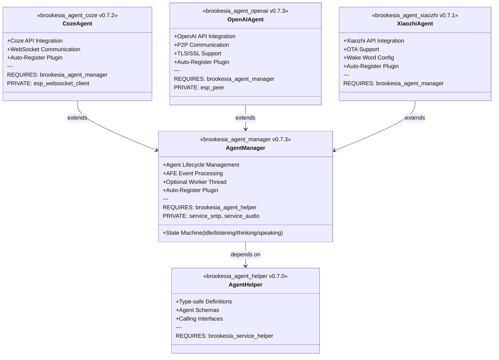

---

## 8. Product Composition

### 8.1 Phone Products

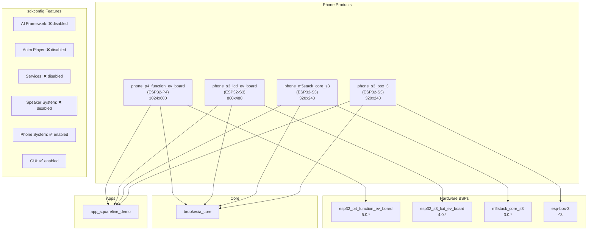

### 8.2 Speaker Product

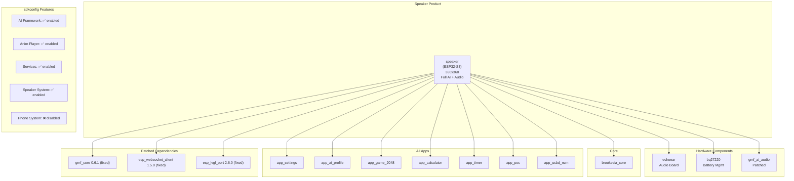

---

## 9. Build System & Configuration Flow

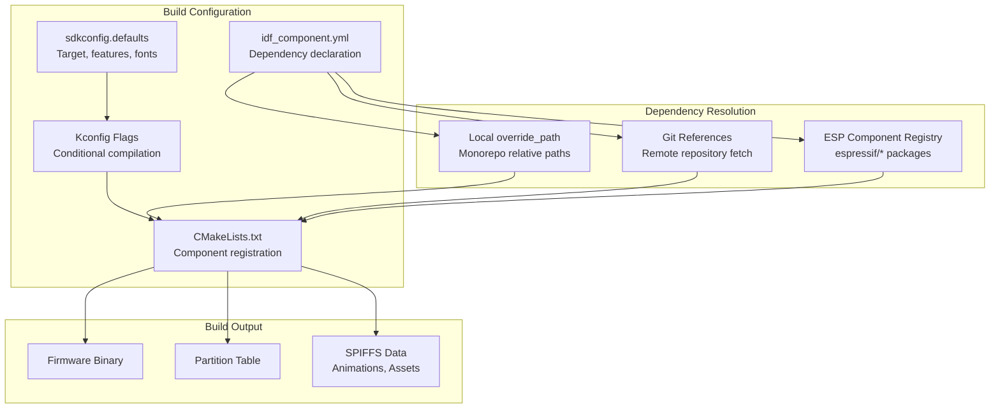

### Standalone Product Build (phone_p4 example)

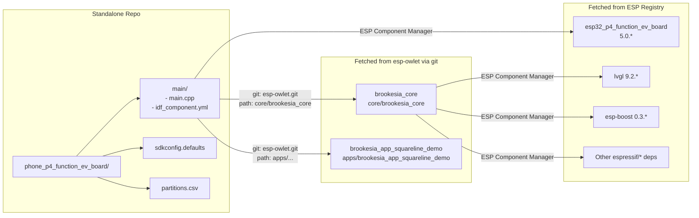

---

## 10. Data Flow

### 10.1 Plugin Registration Pattern

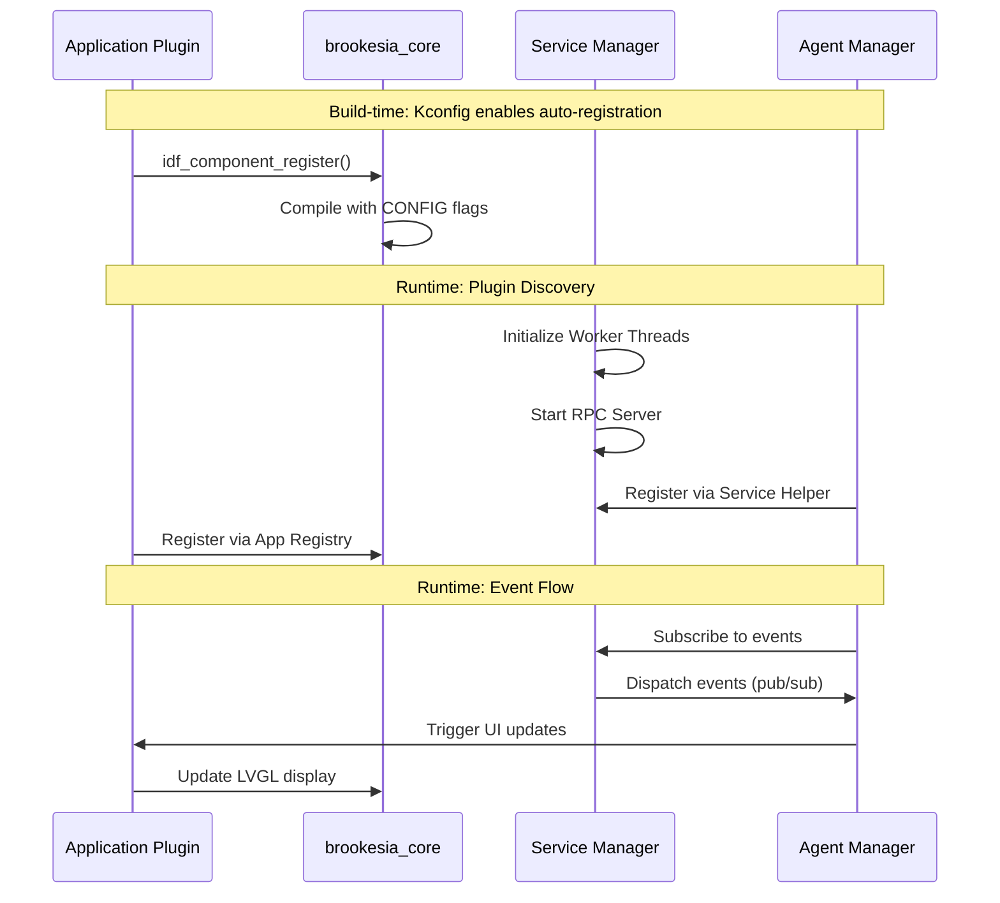

### 10.2 Phone System Runtime Flow

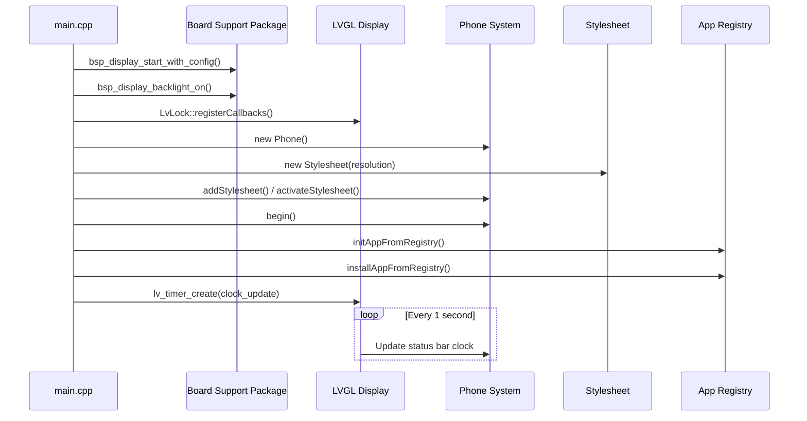

---

## Directory Structure Summary

```
esp-owlet/
├── agent/                              # 🤖 AI Agent Components
│   ├── brookesia_agent_coze/           #    Coze API + WebSocket
│   ├── brookesia_agent_helper/         #    Type-safe definitions
│   ├── brookesia_agent_manager/        #    Agent lifecycle management
│   ├── brookesia_agent_openai/         #    OpenAI API + P2P
│   └── brookesia_agent_xiaozhi/        #    Xiaozhi API + OTA
│
├── apps/                               # 📦 Application Components
│   ├── brookesia_app_ai_profile/       #    AI profile management
│   ├── brookesia_app_calculator/       #    Calculator utility
│   ├── brookesia_app_game_2048/        #    2048 game
│   ├── brookesia_app_pos/              #    Point of Sale
│   ├── brookesia_app_settings/         #    Device settings
│   ├── brookesia_app_squareline_demo/  #    SquareLine UI demo
│   ├── brookesia_app_timer/            #    Timer application
│   └── brookesia_app_usbd_ncm/         #    USB NCM networking
│
├── core/                               # ⚙️ Core Framework
│   └── brookesia_core/                 #    Monolithic core (v0.6.0-beta2)
│       ├── ai_framework/               #    AI agent & expression framework
│       ├── gui/                        #    LVGL wrapper, animation, style
│       ├── services/                   #    Built-in NVS storage service
│       └── systems/                    #    Phone & Speaker system shells
│
├── expression/                         # 🎭 Expression Components
│   └── brookesia_expression_emote/     #    Emote & animation management
│
├── service/                            # 🔧 Service Components
│   ├── brookesia_service_audio/        #    Audio playback & encoding
│   ├── brookesia_service_helper/       #    CRTP-based helper library
│   ├── brookesia_service_manager/      #    Plugin lifecycle + RPC + events
│   ├── brookesia_service_nvs/          #    NVS key-value storage
│   ├── brookesia_service_sntp/         #    NTP/Timezone service
│   └── brookesia_service_wifi/         #    WiFi state machine
│
├── utils/                              # 🛠️ Utility Library
│   └── brookesia_lib_utils/            #    Task scheduler, profilers, logging
│
├── products/                           # 📱 Product Configurations
│   ├── phone/                          #    Phone form-factor products
│   │   ├── phone_p4_function_ev_board/ #    ESP32-P4 (1024x600)
│   │   ├── phone_s3_lcd_ev_board/      #    ESP32-S3 LCD (800x480)
│   │   ├── phone_m5stack_core_s3/      #    M5Stack Core S3 (320x240)
│   │   └── phone_s3_box_3/             #    ESP-BOX-3 (320x240)
│   └── speaker/                        #    Speaker form-factor product
│       ├── main/                       #    Speaker main application
│       ├── common_components/          #    Patched/custom components
│       ├── bootloader_components/      #    Custom bootloader hooks
│       └── spiffs/                     #    SPIFFS filesystem data
│
├── examples/                           # 📖 Example Projects
│   └── service_console/                #    Service + Agent console demo
│
└── docs/                               # 📄 Documentation
```

---

---

# 中文版本 Architecture Document

## 目录

- [1. 概述](#1-概述)
- [2. 高层架构](#2-高层架构)
- [3. 分层图](#3-分层图)
- [4. 组件依赖关系图](#4-组件依赖关系图)
- [5. 核心组件内部结构](#5-核心组件内部结构)
- [6. 服务层架构](#6-服务层架构)
- [7. Agent 层架构](#7-agent-层架构)
- [8. 产品组合](#8-产品组合)
- [9. 构建系统与配置流程](#9-构建系统与配置流程)
- [10. 数据流](#10-数据流)

---

## 1. 概述

ESP-Owlet（基于 ESP-Brookesia）是一个单仓库（monorepo）框架，用于在乐鑫芯片（ESP32-P4、ESP32-S3 等）上构建 AIoT 产品。它提供了模块化的、基于插件的架构，包括：

- **GUI 框架**：基于 LVGL 9.2 构建
- **AI 框架**：支持多供应商 LLM Agent（OpenAI、Coze、小智）
- **服务层**：提供 RPC、事件发布/订阅和插件生命周期管理
- **系统外壳**：支持手机和音箱两种产品形态
- **应用插件系统**：模块化的 UI 应用

---

## 2. 高层架构

（请参考上方英文版本的 Mermaid 图表，图表内容通用）

---

## 3. 分层说明

| 层级 | 组件 | 说明 |
|------|------|------|
| **产品层** | phone_p4, phone_s3, speaker 等 | 硬件特定的构建配置，包含 BSP、sdkconfig、分区表 |
| **应用层** | brookesia_app_* (8个应用) | 可插拔的 UI 应用，全部依赖 brookesia_core |
| **Agent 层** | brookesia_agent_* (5个组件) | AI/LLM 集成，支持 OpenAI、Coze、小智 |
| **表情层** | brookesia_expression_emote | 表情和动画管理 |
| **核心层** | brookesia_core | 单体核心组件，包含 GUI、AI 框架、系统和服务 |
| **服务层** | brookesia_service_* (6个组件) | 基于插件的微服务，包含 RPC、事件、音频、WiFi 等 |
| **工具层** | brookesia_lib_utils | 任务调度器、状态机、插件系统、性能分析、日志 |
| **外部依赖** | LVGL、ESP-IDF、Boost、GMF、BSP | 第三方和乐鑫官方库 |

---

## 4. 组件版本一览

| 组件 | 版本 | 主要依赖 |
|------|------|----------|
| brookesia_core | 0.6.0-beta2 | lvgl 9.2.*, esp-boost 0.3.*, gmf_core ^0.6 |
| brookesia_lib_utils | 0.7.5 | cmake_utilities 0.*, esp-boost 0.4.* |
| brookesia_service_manager | 0.7.4 | brookesia_lib_utils 0.7.* |
| brookesia_service_helper | 0.7.5 | brookesia_service_manager 0.7.* |
| brookesia_service_audio | 0.7.2 | brookesia_service_helper 0.7.*, av_processor |
| brookesia_service_wifi | 0.7.4 | brookesia_service_helper 0.7.*, esp_wifi_remote (P4) |
| brookesia_service_sntp | 0.7.1 | brookesia_service_helper 0.7.* |
| brookesia_service_nvs | 0.7.2 | brookesia_service_helper 0.7.* |
| brookesia_agent_manager | 0.7.3 | brookesia_agent_helper 0.7.*, service_sntp, service_audio |
| brookesia_agent_helper | 0.7.0 | brookesia_service_helper 0.7.* |
| brookesia_agent_coze | 0.7.2 | brookesia_agent_manager 0.7.*, esp_websocket_client |
| brookesia_agent_openai | 0.7.3 | brookesia_agent_manager 0.7.*, esp_peer |
| brookesia_agent_xiaozhi | 0.7.1 | brookesia_agent_manager 0.7.* |
| brookesia_expression_emote | 0.7.3 | brookesia_service_helper 0.7.*, esp_emote_expression |

---

## 5. 关键设计模式

### 5.1 插件自动注册模式

所有 Agent 和 Service 组件使用 Kconfig 控制的自动注册机制：

```
CONFIG_BROOKESIA_AGENT_MANAGER_ENABLE_AUTO_REGISTER=y
```

在 CMakeLists.txt 中通过链接时符号（link-time symbol）实现：

```cmake
target_link_libraries(${COMPONENT_LIB} INTERFACE "-u ${PLUGIN_SYMBOL}")
```

### 5.2 条件编译模式

核心组件通过 Kconfig 标志控制功能模块的编译：

- `CONFIG_ESP_BROOKESIA_ENABLE_AI_FRAMEWORK` - AI 框架
- `CONFIG_ESP_BROOKESIA_ENABLE_GUI` - GUI 模块
- `CONFIG_ESP_BROOKESIA_ENABLE_SERVICES` - 服务模块
- `CONFIG_ESP_BROOKESIA_ENABLE_SYSTEMS` - 系统模块
- `CONFIG_ESP_BROOKESIA_SYSTEMS_ENABLE_PHONE` - 手机系统
- `CONFIG_ESP_BROOKESIA_SYSTEMS_ENABLE_SPEAKER` - 音箱系统

### 5.3 依赖解析模式

组件依赖通过三种方式解析：

1. **override_path**：单仓库内的本地相对路径引用
2. **git + path**：从远程 Git 仓库获取特定子目录
3. **ESP Component Registry**：从乐鑫组件注册表获取

---

## 6. 产品与核心的关系

### Phone P4（作为独立仓库构建）

```
phone_p4_function_ev_board/  （独立仓库）
└── main/idf_component.yml
    ├── brookesia_core ──────── git: esp-owlet.git → core/brookesia_core
    ├── brookesia_app_squareline_demo ── git: esp-owlet.git → apps/...
    └── esp32_p4_function_ev_board ──── ESP Component Registry
```

### Speaker（在单仓库内构建）

```
products/speaker/  （单仓库内）
└── main/idf_component.yml
    ├── brookesia_core ──────── override_path: ../../../core/brookesia_core
    ├── 7 个应用组件 ────────── override_path: ../../../apps/...
    ├── echoear, bq27220 ───── override_path: ../common_components/...
    └── 多个外部依赖 ────────── ESP Component Registry（部分固定版本）
```
